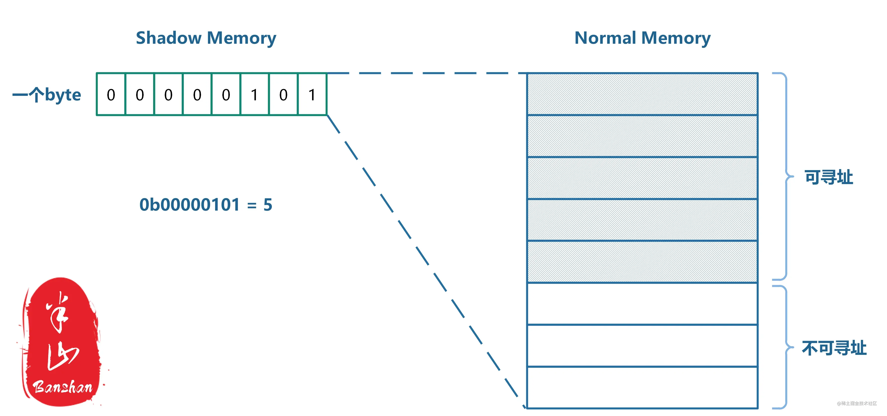
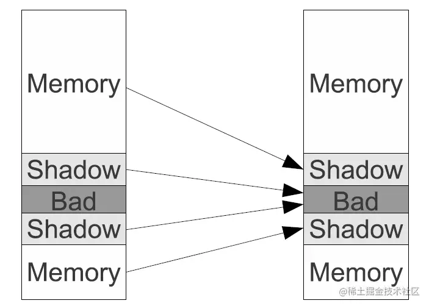
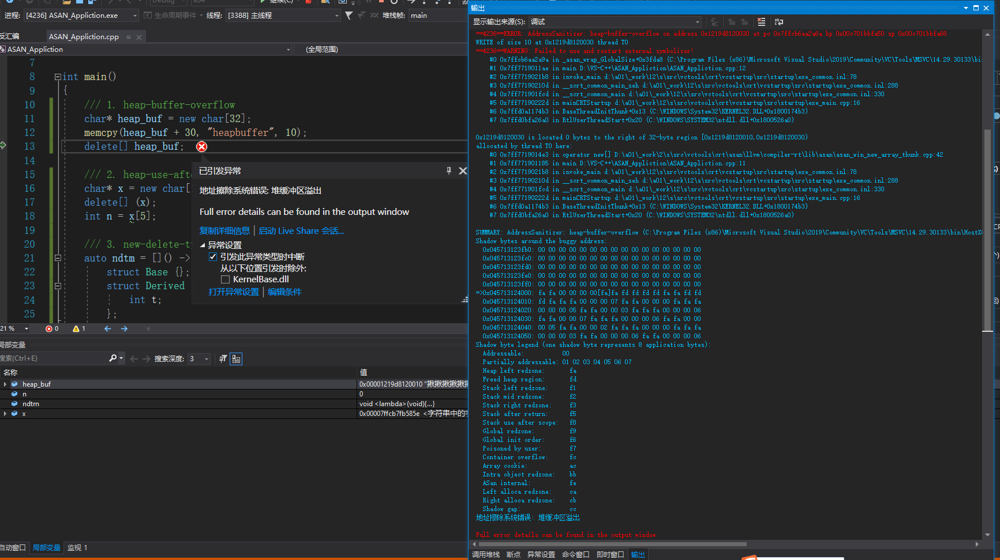

<b>
ASAN，即Address Sanitizer，是一个适用于c/c++程序的动态内存错误检测器，它由一个编译器检测模块（LLVM pass）和一个替换malloc函数的运行时库组成，在性能及检测内存错误方面都比较优秀。
最初由Google引入，在VS2019 的 16.9版本开始，集成进了IDE中，在VS2019安装模块下可以直接安装；
</b>

<h2>一、原理</h2>
<h3>1.1 Shadow Memory</h3>

如果想要了解ASAN的实现原理，那么shadow memory将是第一个需要了解的概念。
Shadow memory有一些元数据的思维在里面。它虽然也是内存中的一块区域，但是其中的数据仅仅反应其他正常内存的状态信息。所以可以理解为正常内存的元数据，而正常内存中存储的才是程序真正需要的数据。
Malloc函数返回的地址通常是8字节对齐的，因此任意一个由（对齐的）8字节所组成的内存区域必然落在以下9种状态之中：最前面的k（0≤k≤8）字节是可寻址的，而剩下的8-k字节是不可寻址的。这9种状态便可以用shadow memory中的一个字节来进行编码。
实际上，一个byte可以编码的状态总共有256（2^8）种，因此用在这里绰绰有余。
 

Shadow memory和normal memory的映射关系如上图所示。一个byte的shadow memory反映8个byte normal memory的状态。那如何根据normal memory的地址找到它对应的shadow memory呢？
对于64位机器上的Android而言，二者的转换公式如下：
Shadow memory address = (Normal memory address >> 3) + 0x1000000000 (9个0)
右移三位的目的是为了完成 8➡1的映射，而加一个offset是为了和Normal memory区分开来。最终内存空间种会存在如下的映射关系：
 

Bad代表的是shadow memory的shadow memory，因此其中数据没有意义，该内存区域不可使用。
上文中提到，8字节组成的memory region共有9中状态：

1~7个字节可寻址（共七种），shadow memory的值为1~7。
8个字节都可寻址，shadow memory的值为0。
0个字节可寻址，shadow memory的值为负数。

为什么0个字节可寻址的情况shadow memory不为0，而是负数呢？是因为0个字节可寻址其实可以继续分为多种情况，譬如：

这块区域是heap redzones
这块区域是stack redzones
这块区域是global redzones
这块区域是freed memory

对所有0个字节可寻址的normal memory region的访问都是非法的，ASAN将会报错。而根据其shadow memory的值便可以具体判断是哪一种错。
```C++
Shadow byte legend (one shadow byte represents 8 application bytes):
  Addressable:           00
  Partially addressable: 01 02 03 04 05 06 07 
  Heap left redzone:     fa (实际上Heap right redzone也是fa)
  Freed Heap region:     fd
  Stack left redzone:    f1
  Stack mid redzone:     f2
  Stack right redzone:   f3
  Stack after return:    f5
  Stack use after scope: f8
  Global redzone:        f9
  Global init order:     f6
  Poisoned by user:      f7
  Container overflow:    fc
  Array cookie:          ac
  Intra object redzone:  bb
  ASan internal:         fe
  Left alloca redzone:   ca
  Right alloca redzone:  cb
  Shadow gap:            cc
```

<h3>1.2 检测算法</h3>
```C++
ShadowAddr = (Addr >> 3) + Offset;
k = *ShadowAddr;
if (k != 0 && ((Addr & 7) + AccessSize > k))
	ReportAndCrash(Addr);
```
在每次内存访问时，都会执行如上的伪代码，以判断此次内存访问是否合规。

首先根据normal memory的地址找到对应shadow memory的地址，然后取出其中存取的byte值：k。
k!=0，      说明Normal memory region中的8个字节并不是都可以被寻址的。
Addr & 7，  将得知此次内存访问是从memory region的第几个byte开始的。
AccessSize是此次内存访问需要访问的字节长度。
(Addr&7)+AccessSize > k，则说明此次内存访问将会访问到不可寻址的字节。
当此次内存访问可能会访问到不可寻址的字节时，ASAN会报错并结合shadow memory中具体的值明确错误类型。


<h2>二、配置</h2>
系统环境变量： ASAN_OPTIONS  =  halt_on_error=0:log_path=asan.log:detect_stack_use_after_return=1 
```
工程 -> 属性 -> C/C++       ->  启用地址擦除系统   
            ->  代码生成    ->  基本运行时检查：默认值 
            ->  命令行      ->  其他选项：/fsanitize-address-use-after-return
            链接器          ->  启用增量链接：否  
```
按照以上属性配置后，debug下运行代码时遇到检测到的内存问题程序会中断，结束运行后会在代码/EXE所在文件夹下生成一个 asan.log.xxx 文件，xxx是出问题的进程ID
<b>
另外开启ASAN后的程序性能，根据网上的测试：
*ASan 支持 arm 和 x86 平台，使用 ASan 时，APP 性能会变慢且内存占用会飙升。
CPU 开销约为 2 倍，代码大小开销在 50% 到 2 倍之间，内存开销很大，约为 2 倍，具体取决于分配模式。
也就是启用ASAN检测之后运行速度大约会变慢2倍左右。
网上其他一些知名的内存检测工具例如 valgrind / Visual Leak Detecter 大概会变慢10倍左右？*
</b>
<h3>三、测试代码</h3>
```C++
    /// 1. heap-buffer-overflow
    char* heap_buf = new char[32];
    memcpy(heap_buf + 30, "heapbuffer", 10); 
    delete[] heap_buf;

    /// 2. heap-use-after-free
    char* x = new char[10];
    delete[] (x);
    int n = x[5];  

    /// 3. new-delete-type-mismatch
    auto ndtm = []() -> void {
        struct Base {};
        struct Derived : public Base {
            int t;
        };

        Base* b = new Derived;
        delete b;
    };
    ndtm();

    /// 可检测的错误类型有很多种，我只放了关于堆的三种，其他的没有贴上来
```
 


<h3>四、相关文档</h3>
https://stackoverflow.com/questions/64635784/how-to-use-msvc-asan-with-visual-studio <br>
https://learn.microsoft.com/zh-cn/cpp/sanitizers/asan?view=msvc-170 <br>
https://www.geeks3d.com/forums/index.php?topic=6838.0 <br>
https://blog.csdn.net/weixin_41255248/article/details/125560886 <br>
https://blog.csdn.net/xhtchina/article/details/121187199 <br>
https://blog.csdn.net/wads23456/article/details/105141997 <br>